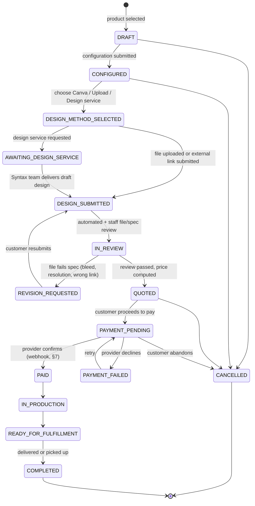

# Listing, Search, Filter, Comparison & Print-Order System — Architecture Review

Status: **Draft for review — no implementation started.**
Owner: Principal architecture pass, covering the 10 required review areas.

This document extends the existing Syntax Technology app (React 19 + Vite + Express,
static data in `src/data.ts` / `src/solutionsData.ts`, in-memory leads/payments in
`server.ts`) with a reusable listing, search, filter, comparison, and print-ordering
system. It does not propose replacing anything that works today; it proposes a
migration path from static arrays to a generic, data-driven catalog.

---

## 0. Baseline constraint (read this first)

The current backend has **no database, no auth, and no file storage** — `leads` and
`transactions` are plain in-memory arrays in `server.ts` that reset on every restart,
`/api/payments/verify` is a stub that always marks a transaction `PAID`, and there is
no user identity anywhere. Every section below assumes three infrastructure additions
that don't exist yet:

| Need | Recommendation | Why |
|---|---|---|
| Persistence | **Postgres** (Neon / Supabase / Cloud SQL — the existing README already implies Cloud Run deployment, so Cloud SQL or Neon both fit) + **Drizzle ORM** | JSONB + GIN indexes give us the attribute-based filtering in §4 without a rigid per-type schema; Drizzle keeps the schema in TypeScript, matching the rest of the stack. |
| Identity | **Lightweight guest identity**: a signed, long-lived cookie/token issued on first visit (no signup), upgraded to an **email-verified identity** only when a user saves a search, requests an alert, or places a print/payment order. No passwords. | The app has no accounts today and the brief doesn't ask for a membership system — but saved searches, alerts, and orders all need *some* durable owner or they're worthless. This is the minimum that satisfies that without a login wall. |
| File storage | **S3-compatible object storage** (Cloudflare R2 or S3) with **pre-signed upload URLs** | Print-ready files (PDF/AI/EPS, tens of MB) must never be proxied through the Express app. |

These are treated as prerequisites for §6–§10, not optional extras — the design below
does not work on top of in-memory arrays.

---

## 1. Domain Architecture

### 1.1 Bounded contexts

```
┌─────────────────────────────────────────────────────────────────────┐
│                            Catalog Context                           │
│  Listing (generic) ──specializes──▶ Solution | Course | PrintProduct │
│                                       | Project                      │
│  FilterDefinition, Category, Tag, Media                              │
└───────────────┬───────────────────────────────────────┬─────────────┘
                │ read                                  │ read
                ▼                                       ▼
┌───────────────────────────┐          ┌────────────────────────────────┐
│   Search & Filter Context │          │      Comparison Context         │
│   SearchIndex, FilterQuery│          │   ComparisonSet (session/user)  │
└───────────────┬───────────┘          └──────────────────────────────┘
                │
                ▼
┌───────────────────────────┐
│  Saved Search & Alert Ctx │
│  SavedSearch, Alert       │
└───────────────────────────┘

┌─────────────────────────────────────────────────────────────────────┐
│                         Print Ordering Context                       │
│  PrintOrder (state machine) ── DesignAsset, Configuration, Quote      │
└───────────────┬───────────────────────────────────────────────────┘
                │ requests payment
                ▼
┌─────────────────────────────────────────────────────────────────────┐
│                          Payments Context (existing, hardened)       │
│  Transaction ── provider adapters: Chapa | Telebirr | CBE Birr |     │
│                  Bank Transfer                                      │
└───────────────┬───────────────────────────────────────────────────┘
                │ deposit/invoice for
                ▼
┌─────────────────────────────────────────────────────────────────────┐
│              Custom Project Pipeline Context (existing leads,        │
│              extended)                                              │
│  Inquiry → Consultation → Assessment → Proposal → Approval →         │
│  Deposit/Invoice → Implementation                                    │
└─────────────────────────────────────────────────────────────────────┘
```

### 1.2 Mapping listing types onto existing data

| Listing type | Existing source today | Becomes |
|---|---|---|
| Technology / Security solutions | `src/data.ts` (`BUSINESS_PILLARS`) + `src/solutionsData.ts` (`SOLUTIONS_DATA`) | `Listing` rows, `listing_type = 'solution'`, `subtype = pillarId` |
| Training courses | `src/data.ts` (`Course[]`) | `Listing` rows, `listing_type = 'course'` |
| Print products | *does not exist yet* | new `Listing` rows, `listing_type = 'print_product'` |
| Projects | `src/data.ts` / `ProjectPortfolio.tsx` (`PortfolioProject[]`) | `Listing` rows, `listing_type = 'project'` |

**Migration path, not a rewrite**: the static arrays become the seed data loaded into
the `listings` table. Existing components (`SolutionsHub.tsx`, `TrainingAcademy.tsx`,
`ProjectPortfolio.tsx`) keep working unmodified against static data until each is
individually cut over to call `GET /api/listings?type=...`, so this can ship
type-by-type instead of as one big-bang release.

### 1.3 Why one generic `Listing` entity, not five tables

The brief is explicit: *"Filters must be data-driven and reusable. Do not hardcode
different filtering logic for every page."* That requirement drives the central
decision of this whole document — **listings are one polymorphic entity with a
`listing_type` discriminator and a JSONB `attributes` bag**, not five separate tables
with five separate query builders. A `SolutionDetail` and a `Course` share almost no
columns, but they share the same *shape of problem*: title, description, media,
category/tags, price-or-quote, and a handful of type-specific facету attributes. One
engine (§4) reads a `FilterDefinition[]` per `listing_type` and builds the query
generically; adding a sixth listing type later means adding data, not code.

---

## 2. Reusable Database Entities

```
listings
  id                uuid PK
  listing_type      text        -- 'solution' | 'course' | 'print_product' | 'project'
  subtype           text null   -- e.g. pillarId 'security', 'technology'
  slug              text unique
  title             text
  short_description text
  long_description  text
  status            text        -- 'draft' | 'published' | 'archived'
  category_id       uuid FK -> categories.id
  price_type        text        -- 'fixed' | 'range' | 'quote_only' | 'tiered'
  price_min         numeric null
  price_max         numeric null
  currency          text default 'ETB'
  availability      text        -- 'available' | 'limited' | 'unavailable' | 'seasonal'
  delivery_modes    text[]      -- 'online' | 'onsite' | 'pickup' | 'shipping'
  location_id       uuid FK -> locations.id null
  industries        text[]      -- facet, e.g. 'government', 'retail', 'banking'
  tags              text[]
  attributes        jsonb       -- type-specific facets, see 2.1
  search_vector     tsvector    -- generated column, see §3
  published_at      timestamptz null
  created_at        timestamptz
  updated_at        timestamptz

categories            -- hierarchical: category / subcategory
  id, parent_id FK -> categories.id null, listing_type, name, slug

locations
  id, name, region, country, lat, lng null

media
  id, listing_id FK, url, kind ('image'|'video'|'doc'), sort_order

filter_definitions        -- §4: the data-driven filter schema
  id, listing_type, key, label, kind, value_type, options jsonb null,
  min numeric null, max numeric null, unit text null, sort_order, is_facetable bool

saved_searches
  id, owner_id FK -> identities.id, listing_type, name,
  filter_query jsonb, sort jsonb, created_at

alerts
  id, saved_search_id FK, owner_id FK, frequency ('instant'|'daily'|'weekly'),
  channel ('email'), last_notified_at, enabled bool

comparison_sets            -- ephemeral, can be session-only, no DB row required
  id, owner_id FK null, listing_type, listing_ids uuid[], created_at

identities                  -- lightweight, see §0
  id, email null, email_verified bool, guest_token, created_at

print_products              -- specialization table, 1:1 with listings.id when listing_type='print_product'
  listing_id PK/FK -> listings.id
  base_price numeric, min_quantity int, turnaround_days_min int, turnaround_days_max int

print_product_options        -- e.g. paper stock, size, finish
  id, print_product_id FK, option_key, label, kind ('select'|'multiselect'),
  choices jsonb   -- [{value,label,price_modifier}]

print_orders                 -- see §6 for full state machine
  id, listing_id FK -> listings.id (the print_product), owner_id FK -> identities.id,
  status text, configuration jsonb, design_method text null,
  design_asset_id FK -> design_assets.id null, quoted_price numeric null,
  transaction_id FK -> transactions.id null, delivery_mode text,
  delivery_address jsonb null, created_at, updated_at

design_assets
  id, print_order_id FK, kind ('uploaded_file'|'external_link'|'design_service_request'),
  file_url text null, external_url text null, service_request_notes text null,
  status ('pending_review'|'approved'|'revision_requested'), created_at

print_order_state_history    -- audit trail for the state machine in §6
  id, print_order_id FK, from_status, to_status, actor, note, created_at

-- existing entities, extended not replaced:
leads             -- unchanged, server.ts today
transactions      -- unchanged shape, gains real provider adapter (§7)
consultation_cases  -- new: formalizes the existing "consultation" lead type into
  id, lead_id FK -> leads.id, status
    ('inquiry'|'consultation'|'assessment'|'proposal'|'approval'|'deposit_invoice'|'implementation'),
  assessment_notes text null, proposal_document_url text null,
  approved_at timestamptz null, deposit_transaction_id FK -> transactions.id null
```

### 2.1 `attributes` JSONB — the type-specific facet bag

Rather than a rigid column per possible facet, each `listing_type` defines its
attribute keys in `filter_definitions`, and `listings.attributes` stores the values:

```jsonc
// listing_type = 'course'
{ "level": "Intermediate", "duration_hours": 24, "mode": "Online training" }

// listing_type = 'print_product'
{ "paper_stock": "300gsm matte", "finish": ["lamination"], "min_order": 100 }

// listing_type = 'solution'
{ "pillar": "security", "deployment": "onsite", "compliance": ["ISO27001"] }
```

A GIN index on `attributes` (`CREATE INDEX ON listings USING gin (attributes)`)
makes containment queries (`attributes @> '{"finish":["lamination"]}'`) fast without
a table per type.

---

## 3. Search Strategy

**Phase 1 (ship this first): Postgres full-text search.**
A generated `tsvector` column combines `title` (weight A) + `tags`/`industries`
(weight B) + `short_description`/`long_description` (weight C), with a `pg_trgm`
GIN index for typo-tolerant/partial matching on `title`. This is sufficient at
current catalog scale (dozens–low hundreds of listings) and needs no new
infrastructure.

```sql
ALTER TABLE listings ADD COLUMN search_vector tsvector
  GENERATED ALWAYS AS (
    setweight(to_tsvector('english', coalesce(title,'')), 'A') ||
    setweight(to_tsvector('english', array_to_string(tags, ' ')), 'B') ||
    setweight(to_tsvector('english', coalesce(short_description,'')), 'C')
  ) STORED;
CREATE INDEX listings_search_idx ON listings USING gin (search_vector);
CREATE INDEX listings_title_trgm_idx ON listings USING gin (title gin_trgm_ops);
```

**Universal search contract**: one endpoint, results grouped by `listing_type` so the
search bar can show "3 solutions, 2 courses, 1 print product" instead of a flat list:

```
GET /api/search?q=cctv&types=solution,course&limit=5   (per-group limit)
→ { groups: [ { type: 'solution', total: 3, items: [...] },
              { type: 'course',   total: 2, items: [...] } ] }
```

Ranking = `ts_rank_cd(search_vector, query)`, with an optional recency/availability
boost (`published_at desc` as tiebreak). Search and filters compose: a query string
narrows by relevance, `filter_definitions`-driven filters (§4) narrow by facet, both
apply to the same underlying query.

**Phase 2 (only if catalog/traffic grows past what Postgres FTS handles well —
roughly thousands of listings or a need for fuzzy multi-language search across
Amharic/Afaan Oromo/Tigrinya content)**: swap the read path for **Meilisearch or
Typesense**, fed by a change-data-capture job from `listings`. Because the search
*contract* (`/api/search`) is stable from day one, this becomes an internal swap, not
an API break — this is the reason to define the endpoint contract now even though
Phase 1 is Postgres-only.

---

## 4. Filter Query Architecture (+ Sorting + Pagination)

### 4.1 Data-driven filter schema

`filter_definitions` (§2) is the single source of truth the brief asks for. Every
supported filter kind maps to one query strategy, applied generically regardless of
`listing_type`:

| `kind` | Example | SQL strategy |
|---|---|---|
| `category` | category/subcategory | `category_id = :id` (subcategory via `categories.parent_id`) |
| `price_range` | ETB 500–5,000 | `price_min <= :max AND price_max >= :min` |
| `date` | project completion, course start | `date_column BETWEEN :from AND :to` |
| `availability` | in stock / limited | `availability = ANY(:values)` |
| `delivery_mode` | onsite/remote/pickup/shipping | `delivery_modes && :values` (array overlap) |
| `location` | region/city | `location_id = ANY(:values)` or geo radius on `locations.lat/lng` |
| `industry` | government, retail | `industries && :values` |
| `tags` | free-form | `tags && :values` |
| `features` (attributes) | "lamination", "ISO27001" | `attributes @> :jsonFragment` (per attribute key) |

### 4.2 Request → query translation

```
GET /api/listings?type=print_product
  &category=business-cards
  &price_min=200&price_max=1000
  &delivery_mode=pickup,shipping
  &attr.finish=lamination
  &sort=price_asc
  &cursor=eyJwcmljZSI6...&limit=20
```

Server-side pipeline (generic — this is the one piece of code, not per-page logic):

1. Load `filter_definitions` for `type=print_product` (cached, rarely changes).
2. For each query param, look up its matching `FilterDefinition` by `key`; **unknown
   keys are dropped, not passed to SQL** (closes the injection/DoS vector in §9).
3. Each recognized filter contributes one parameterized WHERE fragment per the table
   above, built with a query builder (Drizzle/Kysely), never string concatenation.
4. Combine fragments with `AND`; multi-value filters (`delivery_mode=pickup,shipping`)
   combine with `OR` inside their own fragment, `AND` across different filters.

### 4.3 Sorting

`sort` is a **whitelisted enum per listing_type** (e.g. `price_asc`, `price_desc`,
`newest`, `relevance` — `relevance` only valid when `q` is present), resolved to a
concrete `ORDER BY` column server-side. The client never sends a raw column name —
this is both a security boundary (§9) and what keeps sort reusable: adding a new
listing type means adding entries to a small allowed-sort map, not new endpoint code.

### 4.4 Pagination

**Keyset (cursor) pagination**, not offset/limit, because catalogs are edited
concurrently (new print products, status changes) and deep offset pages degrade in
Postgres:

- Cursor = base64 of `{ sortValue, id }` from the last row of the previous page.
- Query becomes `WHERE (sort_col, id) > (:cursorSortVal, :cursorId) ORDER BY sort_col, id LIMIT :limit`.
- Default `limit=20`, hard server cap `limit<=100` regardless of client request.
- Response always includes `nextCursor: string | null` — no `page` numbers, no
  `COUNT(*)` on every request (see §10 on facet-count cost).

---

## 5. Comparison Architecture

- **Same-type only** for a meaningful comparison matrix: a `ComparisonSet` holds up
  to **4 listing IDs of the same `listing_type`** (client enforces this at
  add-to-compare time; server re-validates).
- Comparison is **stateless and client-driven** for the common case — the set of IDs
  lives in `localStorage`, no DB row needed. `POST /api/comparisons { listingIds }`
  simply fetches those rows and builds the matrix; nothing is persisted unless the
  user explicitly saves it (then it becomes a `comparison_sets` row owned by an
  `identity`, same pattern as saved searches).
- The comparison **matrix columns are driven by `filter_definitions`** for that
  `listing_type` (plus a few always-present base fields: price, availability,
  delivery mode) — this is what makes it reusable across solutions/courses/print
  products without per-type comparison UI code: the same component that renders
  filters knows how to render "value for listing A vs B" for each `FilterDefinition`.
- Server caps request size (`listingIds.length <= 4`) and validates all IDs share one
  `listing_type` before querying, to bound cost (§10) and keep the result meaningful.

---

## 6. Print Order State Machine

Two independent flows share the payments context but have different shapes, per the
brief: **standardized print products** (this state machine) vs. **custom technology
projects** (§1.1 pipeline, deposit/invoice not instant checkout).



Rules that make this an actual state machine rather than a status string:

- Every transition is a named server-side function (`transition(order, event)`) that
  validates the *current* state permits the event, writes the new state, and appends
  a row to `print_order_state_history` — no direct `UPDATE print_orders SET status=`
  from a route handler.
- `QUOTED → PAYMENT_PENDING → PAID` is the only path that touches money; price is
  **always recomputed server-side from `print_products`/`print_product_options`** at
  the `IN_REVIEW → QUOTED` transition — the client-displayed estimate during
  `CONFIGURED` is advisory only (§9).
- `AWAITING_DESIGN_SERVICE` is skipped entirely for the Upload/Canva-link paths —
  it only exists on the "Request Syntax Technology design service" branch.

**Custom technology project pipeline** (separate state machine, on
`consultation_cases.status`, no product configuration or file upload involved):

```
Inquiry → Consultation → Assessment → Proposal → Approval → Deposit/Invoice → Implementation
```

This reuses the *existing* `leads` table (type `'consultation'`) as its entry point —
`consultation_cases` is a 1:1 extension row, not a new lead pipeline. Payment here is
a **deposit against an invoice**, gated by `Approval`: the API refuses to create a
deposit `Transaction` for a `consultation_case` that isn't in `approved` state or
later (§7).

---

## 7. Payment Integration Points

Today `/api/payments/initialize` and `/api/payments/verify` are pure simulation (flagged
earlier this session) — this section is also the fix for that.

| Flow | Trigger | Integration point |
|---|---|---|
| Standardized print product | `print_orders` reaches `PAYMENT_PENDING` | `POST /api/payments/initialize` (existing shape, kept) creates a `Transaction` **linked to `print_order_id`**, then redirects to the real provider's hosted checkout (Chapa's `checkout_url` from their `/transaction/initialize` response — today this is faked) |
| Training course | course listing has `price_type='fixed'` | Same `Transaction`/provider path, linked to `listing_id` instead of `print_order_id` |
| Custom project deposit | `consultation_cases.status = 'approved'` | `POST /api/payments/initialize` with `description` derived from the invoice, linked to `consultation_case_id`; **blocked at the API layer** if status isn't `approved`+ |

**What actually needs to change in `server.ts`** (design only, not implementing yet):

1. Real provider adapters behind one interface (`PaymentProvider.initialize()`,
   `.verifyWebhookSignature()`), one adapter per `chapa | telebirr | cbe_birr`;
   `bank_transfer` stays manual (staff marks paid after reviewing a submitted
   receipt — no live API for that method).
2. **`POST /api/payments/webhook/:provider`** — new endpoint. This replaces
   client-polled "verify" as the source of truth: the provider calls this
   server-to-server with a signed payload; the handler verifies the signature,
   looks up the `Transaction` by `txRef`, and idempotently transitions it
   (`INITIATED → PAID`), which in turn drives `print_orders` or
   `consultation_cases` to their next state.
3. `GET /api/payments/verify/:txRef` becomes a **read-only status check** (what the
   frontend polls for UI feedback) — it no longer mutates state itself once the
   webhook exists. This single change closes the "anyone can mark their own order
   paid by GETting the verify URL" gap flagged earlier.

---

## 8. API Design

REST, versioned implicitly by additive-only changes (no `/v2` needed yet).

```
# Catalog / listings (generic across all 4 listing types)
GET   /api/listings                 ?type=&category=&price_min=&price_max=
                                     &delivery_mode=&location=&industry=&tags=
                                     &attr.<key>=&sort=&cursor=&limit=
GET   /api/listings/:slug
GET   /api/filters?type=            → FilterDefinition[] for that type (drives UI)
GET   /api/categories?type=

# Search
GET   /api/search?q=&types=&limit=

# Comparison
POST  /api/comparisons              { listingIds: string[] }  → matrix
POST  /api/comparisons/save         { listingIds }  (requires identity)

# Saved searches & alerts
GET   /api/saved-searches           (requires identity)
POST  /api/saved-searches           { type, filterQuery, sort, name }
DELETE /api/saved-searches/:id
POST  /api/saved-searches/:id/alert { frequency, email }
DELETE /api/alerts/:id

# Print catalog & ordering
GET   /api/print-products           (= /api/listings?type=print_product, convenience alias)
POST  /api/print-orders             { listingId }                         → DRAFT
PATCH /api/print-orders/:id/configuration { options }                     → CONFIGURED
POST  /api/print-orders/:id/design  { method, file? | externalUrl? | serviceNotes? }
POST  /api/print-orders/:id/submit-for-review                             → IN_REVIEW
GET   /api/print-orders/:id/quote                                         → QUOTED (server-computed price)
POST  /api/print-orders/:id/payment                                       → PAYMENT_PENDING (wraps /api/payments/initialize)
GET   /api/print-orders/:id
POST  /api/uploads/print-asset      → { uploadUrl, fileUrl } (pre-signed, §0)

# Custom project pipeline (extends existing leads)
POST  /api/consultations                                                   → Inquiry (= existing lead POST)
PATCH /api/consultations/:id/assessment { notes }
POST  /api/consultations/:id/proposal   { documentUrl }
POST  /api/consultations/:id/approve
POST  /api/consultations/:id/deposit-invoice { amount }                    (wraps /api/payments/initialize)

# Payments (existing, hardened per §7)
POST  /api/payments/initialize
GET   /api/payments/verify/:txRef        (read-only now)
POST  /api/payments/webhook/:provider    (new — source of truth)
```

---

## 9. Security Risks

1. **Client-computed price must never be trusted.** The configuration step will show
   a live estimate for UX, but `IN_REVIEW → QUOTED` **always recomputes from
   `print_product_options` server-side**; the payment amount is the server quote, not
   whatever the client's `POST /api/print-orders/:id/payment` body claims.
2. **Filter/sort injection.** §4.2–4.3 already close this by construction — unknown
   filter keys are dropped, sort is a whitelisted enum — but this must remain true
   even as listing types are added; a code review checklist item, not just a design
   note.
3. **IDOR on orders/transactions.** `print_orders`, `consultation_cases`, and
   `transactions` must be scoped to the requesting `identity` (guest token or
   verified email) server-side on every read/write — today's `txRef`/lead IDs are
   short and guessable (`LT-8910`-style), which is fine for an internal dashboard but
   not once customers can look up *other people's* orders by guessing an ID. Use
   UUIDs for anything customer-facing and check ownership, not just existence.
4. **File upload risk.** Pre-signed direct-to-storage uploads (§0) with: server-side
   allow-list of MIME types (`application/pdf`, `application/postscript`, `image/png`,
   `image/tiff`), a size cap (e.g. 100MB), and the upload URL scoped to one
   `print_order_id` with short TTL. Never accept a raw multipart body into the Express
   process for print files.
5. **External design link (Canva) is a reference, not a fetch target.** Store the
   customer-provided Canva share URL as an opaque string; validate it matches
   Canva's domain pattern for a friendly error message only — **never server-side
   fetch/render arbitrary customer-supplied URLs** (SSRF vector). Staff open the link
   manually.
6. **Payment webhook forgery.** `POST /api/payments/webhook/:provider` must verify
   each provider's HMAC/signature header before trusting the payload, and be
   idempotent on `txRef` (a replayed or duplicated webhook must not double-fulfill an
   order or re-trigger production).
7. **Saved search / alert abuse as a scraping vector.** Rate-limit
   `/api/saved-searches` and `/api/search` per identity/IP; an alert system that
   emails on every new listing is also a spam vector if `email` isn't verified before
   the first alert fires (§0 — identity upgrade requires email verification).
8. **Comparison endpoint resource exhaustion.** Hard cap `listingIds.length` (4) and
   reject mixed `listing_type` sets server-side, not just client-side (§5).
9. Carries forward from the earlier review: **no auth exists on `/api/leads` today** —
   this system adds identity for saved searches/orders, but doesn't by itself fix the
   pre-existing unauthenticated lead-list exposure; that should be closed alongside
   this work, not treated as separately optional.

---

## 10. Performance Risks

1. **Facet counts.** Showing "(12)" next to each filter option requires a `COUNT(*)
   GROUP BY` per facet — expensive if computed live on every filter request across
   the full JSONB `attributes` column. Mitigate with GIN indexes on `attributes` and
   the array columns (`tags`, `industries`, `delivery_modes`) from day one, and if
   catalog size grows, precompute facet counts on a short cache TTL (e.g. 60s)
   instead of live-counting per request.
2. **Deep pagination.** Solved by keyset pagination (§4.4) rather than
   `OFFSET n LIMIT m`, which degrades linearly with `n` in Postgres.
3. **N+1 on listing cards.** Listing cards need `media` + `category` +
   type-specific fields; fetch with a single joined/batched query
   (Drizzle `with`/relational query), not one query per listing per related table.
4. **Search relevance on every keystroke.** Debounce client-side (≈250ms) and cap
   `q` length; the FTS index handles the query cost, but request volume is the real
   risk on a public search box.
5. **Print price computation.** Configuration space (paper × size × finish ×
   quantity tier) is combinatorial; do **not** compute price live by walking every
   option combination on each request. `print_product_options.choices` carries a
   `price_modifier` per choice so price = `base_price + Σ(selected modifiers) ×
   quantity_tier_multiplier` — O(selected options), not O(all combinations).
6. **In-memory backend won't survive this feature set at all** (§0) — this is listed
   again here as a performance/availability risk, not just a data-loss one: every
   `GET /api/listings` under load today would mean rebuilding the whole catalog scan
   with no index, no cache, and no durability across the process restarts Cloud Run
   performs routinely.

---

## Summary — what's actually new vs. reused

- **New**: `listings` (generic, replacing 4 static arrays over time), `filter_definitions`,
  `categories`, `locations`, `media`, `saved_searches`, `alerts`, `comparison_sets`,
  `identities`, `print_products` + options, `print_orders` + state machine,
  `design_assets`, `consultation_cases`.
- **Reused, hardened**: `leads`, `transactions`, the `/api/payments/*` shape (adds a
  webhook, makes verify read-only).
- **Reused, unmodified for now**: `src/data.ts`, `src/solutionsData.ts` become seed
  data; existing components keep working until migrated listing-type by listing-type.
- **Prerequisite, not optional**: Postgres, lightweight identity, object storage
  (§0) — none of §6–§9 work on the current in-memory backend.

Next step once this is reviewed: pick the migration order (recommend starting with
**print products**, since it's the only listing type with zero existing UI/data to
reconcile, then cutting `solutions`/`courses`/`projects` over from their static
arrays one at a time).
